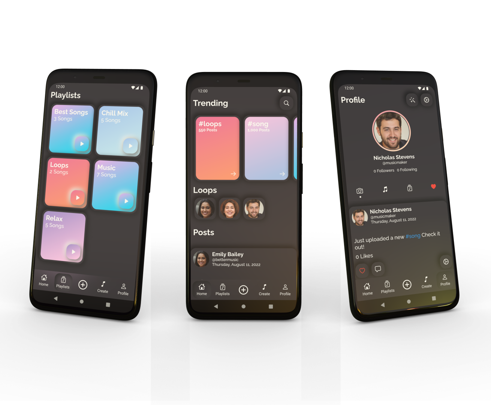
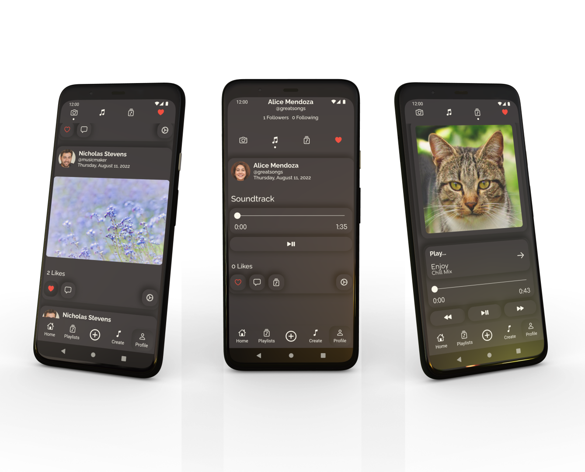
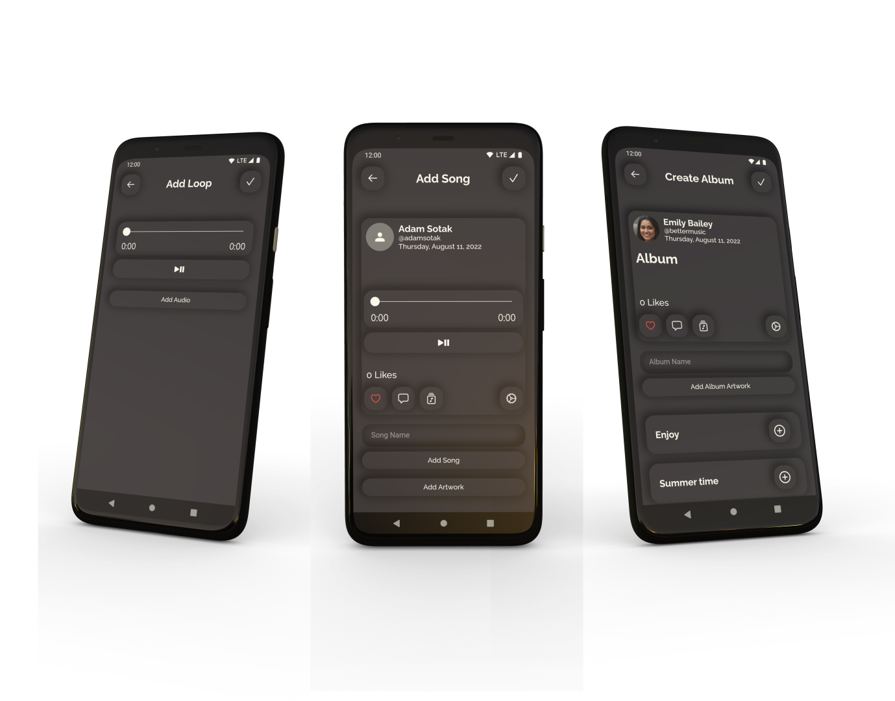
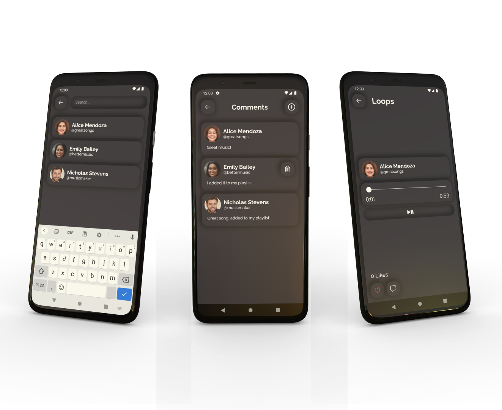
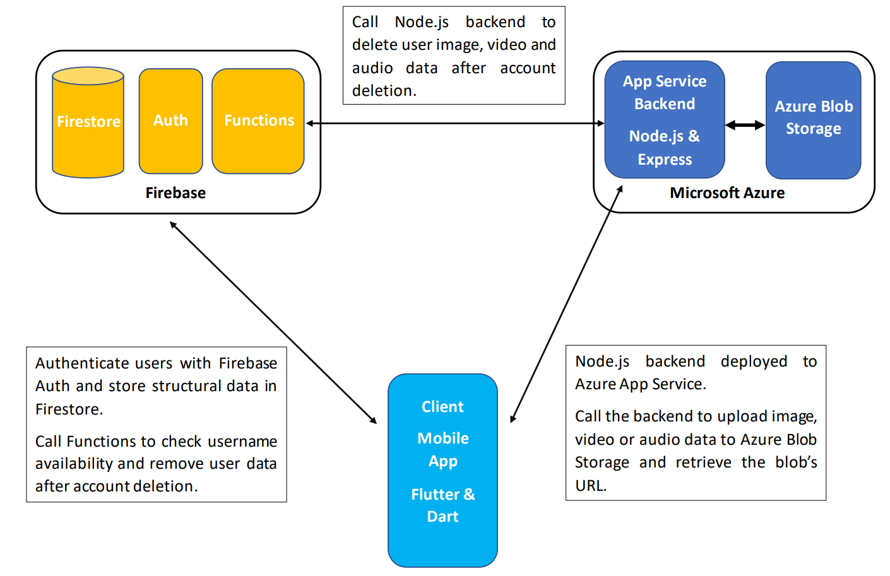

# MusicGallery - Music-centric social media app

## Overview

MusicGallery is a portfolio project application

## Functionality

- User login and account creation
- Upload posts with images or videos as well as songs and loops - short-form audio
- Songs can be combined to create and publish Albums
- Favorite posts and songs can be marked as liked by others and users can create Playlists with their favorite songs or loops

## Technology
 - Flutter & Dart - Mobile app
 - Firebase - Authentication, Firestore and Firebase Functions
 - Node.js and Express - Backend for handling requests to write to Azure Blob Storage
 - Azure App Service - Node.js backend hosting
 - Azure Blob Storage - Storage provider

## Showcase

### Playlists, Home, Profile

### Posts

### Upload pages

### Search, Comments, Loops

## Architecture

Overview of the app's architecture

## Author

[Adam Soták](https://github.com/AdamSotak)

## Acknowledgments

 - In-App images and names - https://thispersondoesnotexist.com/ & https://thiscatdoesnotexist.com/ & https://randomuser.me/